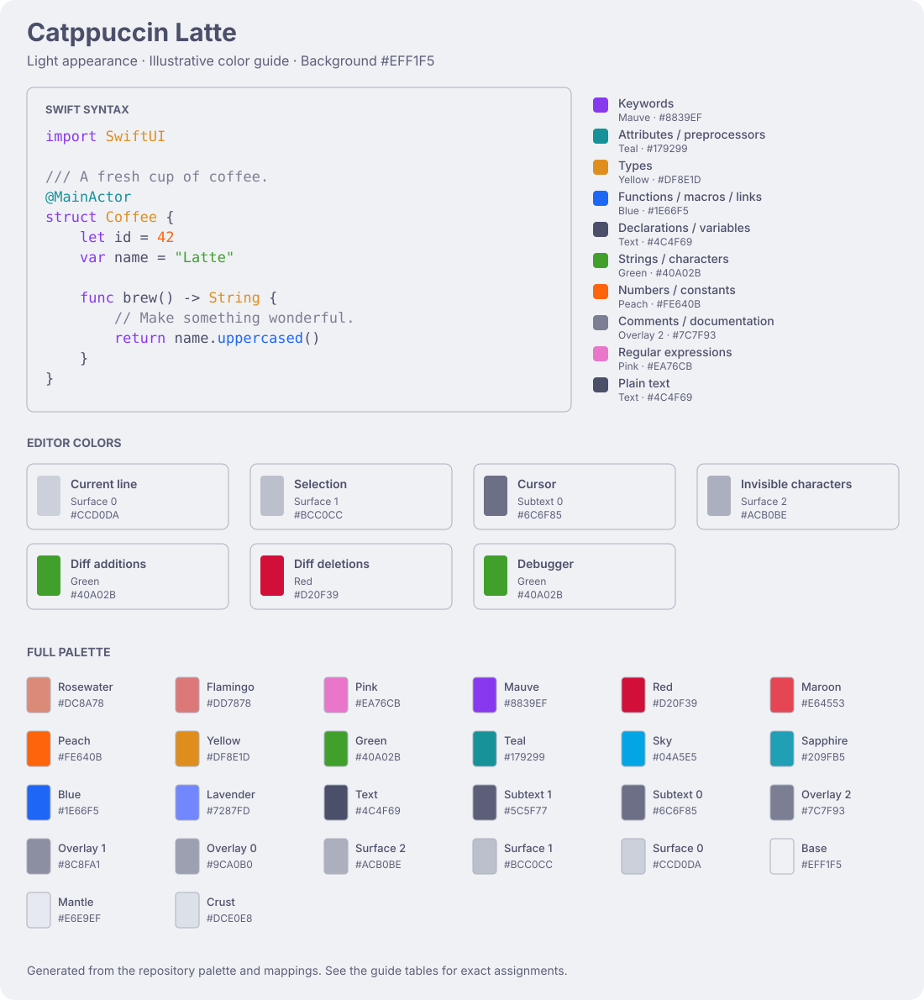

<!-- Generated by scripts/generate_guides.py; edit the sources, then regenerate. -->
# Catppuccin Latte

[All themes](../../README.md#themes-and-status) · [Latte](latte.md) · [Frappé](frappe.md) · [Macchiato](macchiato.md) · [Mocha](mocha.md)

**Light appearance** · [Theme file](../../themes/Catppuccin%20Latte.xcworkspacecolortheme) · [Installation instructions](../../README.md#install)

## Color example



This is a generated color diagram, not an Xcode screenshot. It uses the exact palette and semantic assignments in this repository. Xcode chooses token categories based on language and context, so the same word can receive different colors in real code. The full mapping is available as readable text below.

## Background and interface

| Setting | Palette color | Hex | What it affects |
| --- | --- | --- | --- |
| Background | Base | `#EFF1F5` | Solid background supplied to the workspace theme |
| Foreground seed | Lavender | `#7287FD` | Starting color for Xcode-generated interface colors |
| Background seed | Base | `#EFF1F5` | Starting color for Xcode-generated background treatments |

Other workspace surfaces, console colors, and status treatments are derived by Xcode. They are not independently assigned exact colors by this theme. Fonts and cursor shape are separate settings.

## What each color controls

All **38 explicit assignments** are listed here. “Fallback” is the broader category used when a more specific category is unavailable; specific assignments appear in their own rows.

| Xcode element | Example or use | Palette color | Hex |
| --- | --- | --- | --- |
| Plain text | Punctuation and unclassified source text | Text | `#4C4F69` |
| Comments | // Take a coffee break | Overlay 2 | `#7C7F93` |
| Emphasized comments | Comment emphasis / markers | Subtext 1 | `#5C5F77` |
| Documentation comments | /// A fresh cup of coffee | Overlay 2 | `#7C7F93` |
| Emphasized documentation | Emphasis inside documentation | Lavender | `#7287FD` |
| Keywords | struct, let, var, func, return | Mauve | `#8839EF` |
| Attributes | @MainActor, @State | Yellow | `#DF8E1D` |
| Strings | "Coffee is ready" | Green | `#40A02B` |
| Regular expressions | /[A-Z]+/ | Pink | `#EA76CB` |
| Numbers | 42, 3.14 | Peach | `#FE640B` |
| Character literals | 'A' in a language with character literals | Teal | `#179299` |
| Links | URLs in source documentation | Sapphire | `#209FB5` |
| Preprocessor directives | #if, #endif | Pink | `#EA76CB` |
| Project macros | A macro defined in your project | Pink | `#EA76CB` |
| System macros | A macro supplied by the SDK | Pink | `#EA76CB` |
| Type declarations | Coffee in struct Coffee | Yellow | `#DF8E1D` |
| Member declarations | The declared property or function name | Blue | `#1E66F5` |
| Project types — fallback | A type from your project | Yellow | `#DF8E1D` |
| Project classes | A reference to your CoffeeStore class | Yellow | `#DF8E1D` |
| Project type references | A reference to your Coffee type | Yellow | `#DF8E1D` |
| Project members — fallback | A member from your project | Text | `#4C4F69` |
| Project functions | A call to your brew() function | Blue | `#1E66F5` |
| Project constants | A reference classified as a project constant | Peach | `#FE640B` |
| Project variables | A reference classified as a project variable | Text | `#4C4F69` |
| External types — fallback | A type provided by a framework | Yellow | `#DF8E1D` |
| External classes | A reference to an SDK class | Yellow | `#DF8E1D` |
| External type references | String, Int, Text | Yellow | `#DF8E1D` |
| External members — fallback | A member provided by a framework | Lavender | `#7287FD` |
| External functions | print(), uppercased() | Blue | `#1E66F5` |
| External constants | A reference classified as an SDK constant | Peach | `#FE640B` |
| External variables | A reference classified as an SDK variable | Lavender | `#7287FD` |
| Selection background | The fill behind selected text | Surface 1 | `#BCC0CC` |
| Cursor color | Your text insertion point | Rosewater | `#DC8A78` |
| Current line background | The fill behind the active line | Surface 0 | `#CCD0DA` |
| Invisible characters | Visible whitespace markers when enabled | Surface 2 | `#ACB0BE` |
| Diff additions | Added code in a comparison | Green | `#40A02B` |
| Diff deletions | Removed code in a comparison | Red | `#D20F39` |
| Debugger | The debugger color supplied to Xcode | Teal | `#179299` |

## Palette reference

These are all 26 official Latte colors. A color being in the palette does not mean Xcode uses it as an explicit override.

| Color | Hex | Use in this theme |
| --- | --- | --- |
| Rosewater | `#DC8A78` | Used by this theme |
| Flamingo | `#DD7878` | Available in palette; not explicitly assigned |
| Pink | `#EA76CB` | Used by this theme |
| Mauve | `#8839EF` | Used by this theme |
| Red | `#D20F39` | Used by this theme |
| Maroon | `#E64553` | Available in palette; not explicitly assigned |
| Peach | `#FE640B` | Used by this theme |
| Yellow | `#DF8E1D` | Used by this theme |
| Green | `#40A02B` | Used by this theme |
| Teal | `#179299` | Used by this theme |
| Sky | `#04A5E5` | Available in palette; not explicitly assigned |
| Sapphire | `#209FB5` | Used by this theme |
| Blue | `#1E66F5` | Used by this theme |
| Lavender | `#7287FD` | Used by this theme |
| Text | `#4C4F69` | Used by this theme |
| Subtext 1 | `#5C5F77` | Used by this theme |
| Subtext 0 | `#6C6F85` | Available in palette; not explicitly assigned |
| Overlay 2 | `#7C7F93` | Used by this theme |
| Overlay 1 | `#8C8FA1` | Available in palette; not explicitly assigned |
| Overlay 0 | `#9CA0B0` | Available in palette; not explicitly assigned |
| Surface 2 | `#ACB0BE` | Used by this theme |
| Surface 1 | `#BCC0CC` | Used by this theme |
| Surface 0 | `#CCD0DA` | Used by this theme |
| Base | `#EFF1F5` | Used by this theme |
| Mantle | `#E6E9EF` | Available in palette; not explicitly assigned |
| Crust | `#DCE0E8` | Available in palette; not explicitly assigned |

## Try it

```sh
sh install.sh latte
```

Run this from the downloaded repository, restart Xcode when convenient, then select **Catppuccin Latte** in **Settings → Appearance → Theme → Choose…**. Use **Light** appearance.

The diagrams describe the intended mappings; they do not establish that every Xcode surface has been visually tested. See the [verification record](../VERIFICATION.md) for the current testing status.
